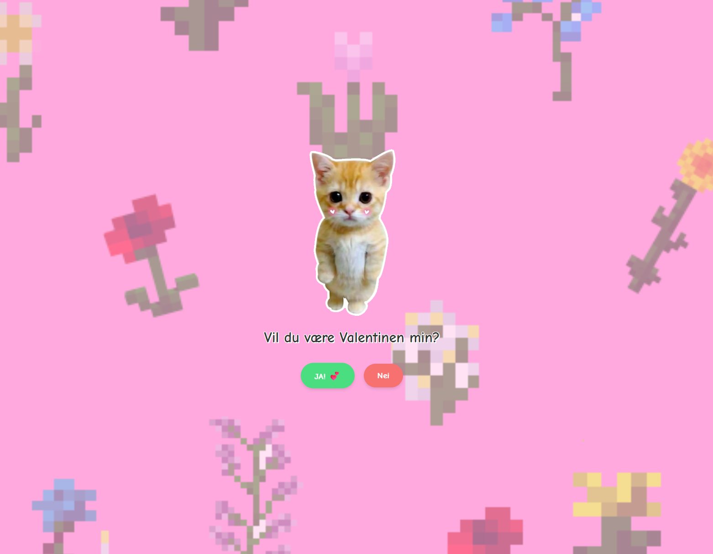

# 💕 Valentine Card

En interaktiv digital valentinkort laget med ren HTML, CSS og JavaScript.

## ✨ Funksjoner

- 💚 "Ja"-knapp som viser en fin suksess-melding
- ❤️ "Nei"-knapp som flytter seg unna når du prøver å klikke (umulig å trykke!)
- 📱 Responsiv design som fungerer på mobil og desktop
- 🎨 Pen animasjon og design
- 🇳🇴 Fullt på norsk

## 🚀 Bruk

Nettsiden fungerer direkte i nettleseren - ingen installasjon nødvendig!

Bare besøk: [https://runestavenes.github.io/valentinemain](https://runestavenes.github.io/valentinemain)
---
## 🙏 Credits

Opprinnelig konsept fra [krystianslowik/walentyna](https://github.com/krystianslowik/walentyna)

Reimplementert i ren HTML/CSS/JS uten React for enklere bruk.

## 📄 Lisens

Fri bruk - del og tilpass som du vil! 💕

---

Laget med ❤️ for Valentinsdagen
